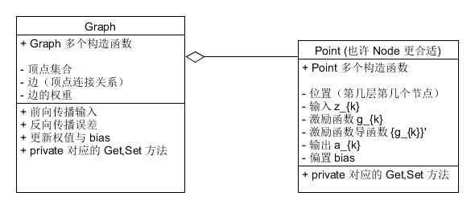

% Implementation of `Backpropagation` in Java.
% MiaoDX MiaoDX@hotmail.com
% Oct, 2016

## Statement

这里不证明 BP 算法，仅是利用已有结论（寻求证明可以参见 `README` 中的参考文章）来叙述如何使用 Java 实现此算法以及一些取舍与 tricks。


## Analysis

目前来看，整个算法是很简单的，但考虑到自己一开始时的茫然，想必应该是是“会了不难，难了不会”。直接给出本实现对应的示意图如下（取自 [A Gentle Introduction to Artificial Neural Networks](https://theclevermachine.wordpress.com/tag/backpropagation/)）：


可以看出 I,II 的计算顺序是需要保证的，I 依次向后，II 依次向前，III 与 IV 的计算顺序随意（向后或向前均可）。需要特别注意的只有 II，编程时也是要注意这一点，特别是计算 $\delta$ 时需要考虑 $g_{k}$ 在 $z_{k}$ 上的导数值。

另外，图中没有展示 $bias$ 值的更新，需要注意一下（参考文章中有提），也就是 $b_{k} = b_{k} - \eta \delta_{k}$。

## Data structure

从示意图可以看出，我们最好是能够构建出一个图出来，我没有进行太多的调查，也许是有不错的图的实现的 ~~发现了Guava 中有 Graph 的部分，下午看了一下，可以考虑重写一下了 -.-~~，这里是自己手工构建了一个。

有几个需要考虑的问题：

* 图的表示
* 图的层数
* 顶点所包含的内容


按照 `OO` 的设计准则，我们把上面四个步骤中的参数进行分配：

图：顶点的连接（边）、边上的权重 `$w_{ij}$` 

顶点：其余所有的参数（`$z_{k}$,$g_{k}$,$a_{k}$,$bias$`）

其中，需要注意的是`激活函数$g_{k}$`的分配，赋给顶点会带来一定的空间开销（每个顶点都需要保存函数及其导函数），但是带来的好处是我们可以很方便地修改每个顶点对应的激活函数，这很方便测试（我们可以使用简单的函数进行测试），另外，在构建图时也需要对函数的选型做出调整，比如说对函数进行模拟时，最后一层（输出层）的激活函数可以考虑选为线性函数（比如 `$f(x)=x$`）。

尝试画一个粒度很粗的 UML 图：



# Implementation

## 遍历图

在具体实现时，需要对图进行遍历（上面的 I,II,III,IV）均需要，只对点进行的操作（如更新 bias）还好说，但是对权值的存取都需要一个便于操作的数据结构，尝试了一些方式，最终选取 `[Guava](https://github.com/google/guava/wiki)` 中的 `HashBasedTable` 来做。

需要注意的是如何有效地求取顶点的前驱与后继，这在目前的实现中不是很容易（/直观），需要对 `Table` 进行处理：

``` java
[...]

private Table<Point, Point, Double> weightedGraph = HashBasedTable.create();

[...]
for(Map.Entry<Point, Double> after: weightedGraph.row(nowPoint).entrySet()){
                Point afterPoint = after.getKey();
                updateWeight(nowPoint, afterPoint);
}
[...]
```


## 遍历顶点的顺序

上面的代码没有考虑 `nowPoint` 的选取顺序，在 `DEBUG` 中发现了一些有趣的问题，结果总是没道理的不对，且直接 `RUN` 与 `DEBUG` 的结果不同 ~.~，这种情况首先是想到并发的问题，可明显没有并发啊！！一步步地跑，终于发现是遍历 `nowPoint` 的顺序并不固定。给个简单的例子：


在前向传播时，原本是应该先计算 `$P_{10}$,$P_{11}$,$P_{12}$` 然后是计算 `$P_{20}$`，可是实际上没有对此顺序进行规定，所以实际上并不能保证正常运行。所以，新定义

``` java
private List<Point> pointsInOrder = new ArrayList<Point>();
```

在遍历时按照此顺序进行就可以了（当然，反向遍历应该也是比较直观了）。

将算法示意图中的步骤转化为代码在有了数据结构的定义后便很清晰了，这里便不再赘述。

## 激活函数相关

激活函数一般有 `sigmoid,tanh,ReLU` 等，将激活函数写死是没有道理的，所以将其分配到了 `Point` 中，需要注意的是要能够比较方便地进行更变，在 Java 中原本实现“将函数作为参数传递”不太容易，比较幸运的是 Java8 引入了 `Lambda` 表达式，我们便是使用这来很方便地更改激活函数。

``` java
public static Function<Double,Double> sigmoidLambda = input -> sigmoid(input);
```

这样可以在外部引用此方法，然后调用其 `applay()` 即可。

## 显示结果

我们在编写完成后，进行测试可以直接跟踪一些简单的图的几个步骤，比如 `GraphTestOneLayer.java` 中的 `oneLayerWithHalfAndSameActivationFunction` 便使用 `AssertJ`（其他的测试库亦可）来进行测试。

但是最终，我们还要直观地展示结果才好啊。找寻了几个展示图标的库都不太理想，还好在 github 上尝试了一下，在 Java 下的绘图库中找到了 [XChart](https://github.com/timmolter/XChart)，很不错，值得尝试（比较活跃，非常好的 tutorial） ^_^

需要指出的是，在 `@Test` 中是不能正常显示的，解决方案是在绘图后 `Thread.sleep(10000)` 停个十秒，这有点不太理想，但 work。

另外，展示时最好展示地多些，即比样本要更加密集，这样可以看出是不是仅仅是 fit 样本还是能比较好得模拟整个函数（这里是说我们对函数进行模拟时）。

下面是几组实验结果，采取的都是隐藏层定点数为 3，且只有一个输入输出，除输出节点外的激活函数均为 `sigmoid`，输出节点激活函数为 `f(x)=x`，最大 epoch 数为 `150000`（十万次），允许的最大均方误差 MSE 为 `1e-4`，选取的样本数为 `$(-\pi,\pi)$` 上的 `100` 个样本点，随机数生成器种子为 0.

选取模拟函数为 `f(x)=sin(x)`，结果如下：
跑完了所有 epoch，最终训练集上的均方差为 `7.38716002130231E-4`，一些结果图如下：

样本集上的拟合结果：


自定义域扩大一倍，采样点密集程度扩大一倍，这不是显示结果的好坏，只是显示一下拟合图像在超过定义域的情形：


均方差变化：


在测试集上的结果，测试集选取相同定义域，更加密集的取点，共选取了 198 个点，结果图如下：


测试集上均方误差为 `0.502456593095013`，这是不太可以接受的（随机种子改为 1 后，结果为 `0.5022908218632693`），这也充分说明了训练集与测试集结果的极大不同。

## 一些注意事项与感想

1.验证结果时需要保证 **数据集与测试集完全不同**

2.模拟函数的“简单”与“复杂”

直观感觉 `f(x)=sin(x)` 要比 `f(x)=0.5*sin(x/2)` 简单，但我们看一下真实图形：


可以看出，`sin(x)` 的函数图像复杂度更高（变化程度更大，曲线更抖），所以，在拟合函数时直观的不一定正确，这也可以推导到其他情形。

另外，同一条曲线进行拟合如果选取的定义域不同，其结果亦有所不同，我们下面给出相同的网络设置，取 `sin(x)` 在 `(0,\pi/2)` 上的结果，也是跑完了所有的 epoch，误差为 `1.864210173680671E-4`：


样本集上的拟合结果：


自定义域扩大一倍，采样点密集程度扩大一倍（点数是之前的四倍，应该将测试集的数据剔除）：


均方差变化：


在测试集上的结果图如下：


可以看出，两次拟合的在样本点定义域外的部分很不相同（当然，事实上是不需要考虑定义域外的情况的，但是能从侧面说明函数的拟合是使用一个比较高维的曲线进行的）。


3.上面均方差的变化会发现有上升的情况（特别是在 $(-\pi,\pi)$ 上的实验），这不太满足“梯度下降”的说法

这是可以理解的，因为我们显示的误差是样本的均方误差，网络每次训练对单个样本进行“优化”，但是有可能结果会导致对某些组样本数据很不好，而产生较大的均方误差（**这可以通过去除较大的误差来验证，比如显示中间 80%的结果**），我们进行一下模拟，选取第一个实验前 `2000` 的均方差变化，三条曲线分别为`全部输出的均方差`、`排序后去除首尾十分之一的均方差`、`排序后首尾十分之一的均方差`：


可以看出只显示中间的 80% 均方差的曲线会比较平滑，比如 `200-400` 内`全部输出的均方差`明显变化较大，这与我们的解释是可以吻合的。


