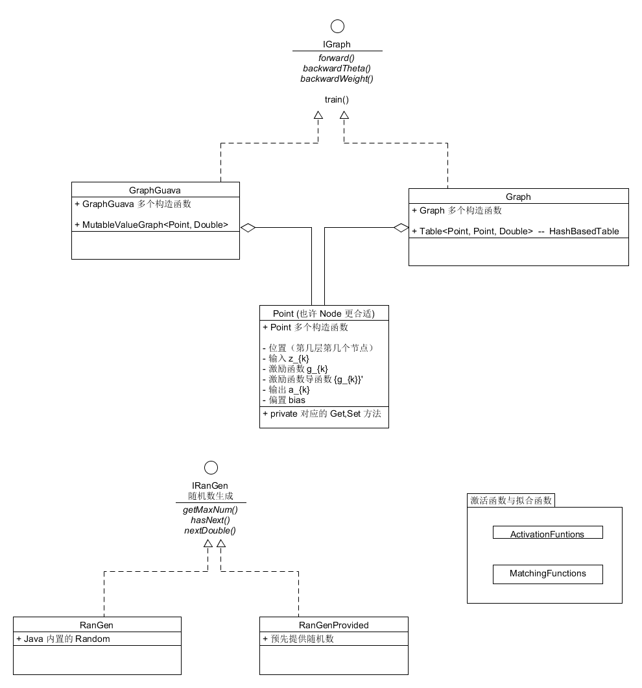
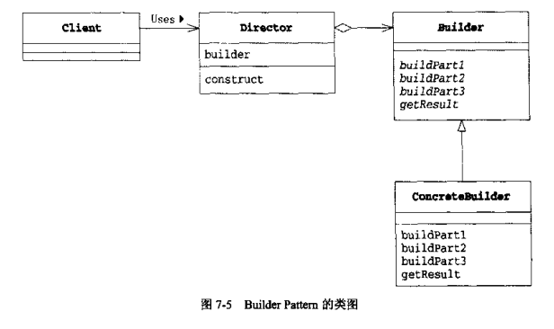

## 说明

本次设计模式作业以一个具体的编程项目 -- 实现一个 BP（反向传播） 神经网络来模拟一些简单的函数（如 $f(x) = asin(bx)+ccos(dx)+e$）作为基础，讨论一些在实现过程中使用到的与设计模式相关的内容，并且给出一些自己对于部分设计模式的理解，其内容可能会有些贻笑大方，但不积跬步无以至千里 ^_^

本文档与 [DesignAndImplement.md](DesignAndImplement.md) 从不同角度进行描述，共同构成了本项目较为完整的分析与实现。本文档是项目实现过程中决策的选取记录，且论述一些对部分设计模式的思考。

另，下文中若不单独提出，“书”指的是《设计模式--Java语言中的应用》。

## 面向接口编程

### 接口设计之 图的数据结构

在初次进行编程实现时没有注意到 `Guava.graph` 的存在，所以使用了 `HashBasedTable` 来存储图，也就是：

``` java
private Table<Point, Point, Double> weightedGraph = HashBasedTable.create();
```

但考虑到使用更契合的结构会有利于理解，后来用重新使用 `ValueGraph` 来存储图信息，亦即：

``` java
private MutableValueGraph<Point, Double> weightedGraphGuava = ValueGraphBuilder.directed().build();
```

同时考虑到之前的代码已经能很好的处理“单输入单输出函数”的模拟，决定原则上对之前的代码不做改动。所以首先是将图抽象为一个接口 `IGraph`，并将一些公共的方法放在了 `IGraph` 中。

### 接口设计之 随机数生成

初始化时需要对图中边的权值、节点的 `bias` 赋初值，刚开始时也没太注意，直接使用 `Java` 自带的 `Random` 及其 `nextDouble()` 方法。但是在验证程序正确性时发现这种方法很不好，虽然在固定了 `Random` 的 `seed` 后生成的随机数是固定的，但没有任何规律。原本程序就充满了遇见 `bug` 的可能，所以尽量去除不确定因素好些，所以重新设计了一个生成随机数的接口：

``` java
public interface IRanGen {
    
    public int getMaxNum();
    public boolean hasNext();
    public double nextDouble();
}
```

并且给出此接口的两个实现，一个是对 `Java` 自带的 `Random` 的封装（`RanGen.java`），一个是预先指定要生成的随机数（`RanGenProvided.java`）。

### 整个项目的简略 UML



其中有一些具体信息与联系并没有画出，但接口间的实现关系都表现出来了。

### 思考

从上面可以看出，本项目所有接口的设计并不是在开始时便确定了的，而是在遇到新的问题（/需求）时才重新设计得到。不知理想情况下是应该像目前这样“增量”进行还是一开始时便设计好了的。个人觉得还是逐渐得到的可能性更大，毕竟准确地预见项目的规模与走向是不太容易的。

接口给自己的印象与 `UML` 中的  `use case` 很相似，都是“系统对外界提供的功能”，嗯，与 `Cpp` 中的头文件也是很相似。

## Iterator

### 迭代器使用之 随机数生成

按照老师的说法，迭代器目前的使用场景并不太多，毕竟在 Java 中对于“集合”的遍历都是已经内置了的，随机数生成是很“正宗”的迭代器使用（和书中的例子简直相同），随机数生成的接口如上。

### 迭代器使用之 图的遍历

这里说的是使用 `HashBasedTable` 作为数据结构的图，对图节点的遍历需要取节点的 `row` 或者 `column`，以更新权值为例：

```
for(Map.Entry<Point, Double> after: weightedGraph.row(nowPoint).entrySet()){
                Point afterPoint = after.getKey();
                updateWeight(nowPoint, afterPoint);
}
```

### 思考

不同语言中对 `for each`、`range-based for` 都有不少语法糖，且 `IDE` 也会对此进行提示，比如 `Intellij IDEA` 中对一个数组进行 `i++` 方式的遍历时会有如下提示：


另外，对于自己实现的“随机数生成”的类，感觉也许是有类似的库的。


## Template Method（模板方法）

### 神经网络的训练

两种数据结构实现的图均有 `train` 的方法，且都是调用自身的三个方法，我们一开始将 `IGraph` 定义为了接口，在接口中是不能有函数实现的，起初还没有太在意，所以在两个实现类中均包含了相同的方法定义。昨天翻书时发现这正好一种模板方法，所以，便将 `IGraph` 定义为抽象类，并以 `final` 的方式实现 `train` 方法：

``` java
public abstract class IGraph {
    abstract public void forward();

    abstract public void backwardTheta();

    abstract public void backwardWeight();

    final public void train() {
        this.forward();
        this.backwardTheta();
        this.backwardWeight();
    }
}
```

### 思考

这种转变乍看起来并非是必要的，毕竟在每个类中写相同 `train` 方法并没有太多的代码量，但这样在其他人看代码时会更加清晰。

但还是有些问题，这便是有些涉及个人喜好了，相较于抽象类，我更喜欢使用接口来作为公共方法的呈现形式，为了查明抽象类与接口的区别，在 SO 上查看了一下突然发现在 `Java8` 中引入了 [Default Methods (Defender Methods)](https://dzone.com/articles/introduction-default-methods)，所以还是转回接口实现 `IGraph`：

``` java
public interface IGraph {
    public void forward();

    public void backwardTheta();

    public void backwardWeight();

    default public void train(){
        this.forward();
        this.backwardTheta();
        this.backwardWeight();
    }
}
```

嗯，这样就舒服多了 -.-


## 部分其他设计模式

本小节对应的内容并非是本项目实现的内容，放在这里算是一些分析以及 `TODO`。

### Builder 

书中的 `Builder` 方法（记为方法一）与 [Builder Design pattern in Java - Example Tutorial](http://javarevisited.blogspot.sg/2012/06/builder-design-pattern-in-java-example.html) 所说的（记为方法二）好似并不是同一件事情，而且与 `ValueGraphBuilder.directed().build()`(`Guava.graph`)（记为方法三）又有不同 ~

方法一，亦即书中的 `builder` 使用的 `UML` 如下：



它更加注重的是使用抽象的 `Builder` 提供 `API`，具体地 `ConcreteBuilder` 可以在实现此 `API` 后提供不同的功能。


方法二中的示例很是奇特，它解决的问题是当一个类有很多可配参数时，如果是对每一种参数组合均提供构造函数是不可取的，所以在类的内部声明一个 `Builder` 类，并由 `Builder` 来生成此类。（可能是有些不清楚，请参见原链接，博客中的例子很容易理解）


`ValueGraphBuilder.directed().build()` 只是提供了一个包装来返回想要产生的类，不把图的构造函数给暴露出来（这点与方法二相同），与要产生的类不是内外部类的关系（这与方法二把 `Builder` 作为内部类不同）。

虽然是对三种用法进行了简要分析，目前还是有些乱。-.-

### Bridge（TODO）

目前对桥接模式的利用是有些想法的，主要是在于对 `Graph` 的信息进行展示时目前是使用 `XChart` 来进行处理，可是遇见了一些问题（同时保存多张图总是不成功），可以考虑采用不同的绘图库进行绘图，将它们作为不同的“实现的类层次”。

## 小结

### 设计模式的新实现

上面论述 `Template Method` 中提到了接口中可以有 `Defender Methods` 来作模板方法，我觉得这种实现比使用抽象类更加舒服，这也让我联想到了使用 enum 来实现单例模式 -- [Why Enum Singleton are better in Java](http://javarevisited.blogspot.sg/2012/07/why-enum-singleton-are-better-in-java.html)，所以，不同设计模式的 "state of art" 实现是会慢慢改变的。

### 关于设计模式

目前自己还处于“往上靠”的阶段，比如说上面的模板方法的使用，在没有重新看书时并没有意识到可以使用这种方法。

当然，总是要先练习，甚至是刻意地练习，才能逐渐掌握、融会贯通。

### Java 语言的演化

本科期间学习 `Java` 时使用的教材是《Thinking in Java》，大概在讲到 "Interfaces" 一章我就没跟上了，再加上当时对所谓 `Java` 效率不高的印象，便没太认真学习。可是目前来看， `Java` 语言是非常不错的，若是追求性能可以对并发编程以及 `JVM` 本身进行更加深入的研究。且不说这些，本项目是上半学期完成的三个课程设计之一，三个课程设计两个是使用 `Java` 来写的（另一个是 `Javascript`），这两个 `Java` 项目都进行了不同程度的大规模“重构”（/改写），整个过程并没有感到复杂到不敢修改之前的代码，且代码模块化、结构化都做的还不错。

另外， `Java` 语言本身也在进行着演变，特别是 `Java8` 中对 `Lambda,Stream` 以及一系列函数式编程的支持，使得我们可以更加容易写出紧凑且具有表现力的程序。甚至在某一程度上降低了自己对 `scala` 学习的热情（这有些好坏参半吧） -.-

## Good Luck & Hava Fun !