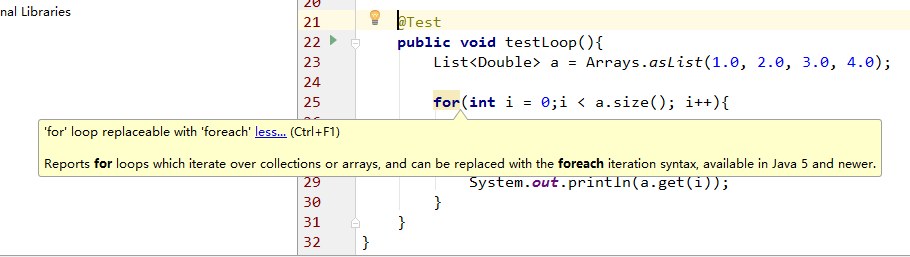

## 说明

本次设计模式作业以一个具体的编程项目 -- 实现一个 BP（反向传播） 神经网络来模拟一些简单的函数（如 f(x) = asin(bx)+ccos(dx)+e）作为基础，讨论一些在实现过程中使用到的与设计模式相关的内容，并且给出一些自己对于部分设计模式的理解，其内容可能会有些贻笑大方，但不积跬步无以至千里 -.-

本文档与 [DesignAndImplement.md](DesignAndImplement.md) 从不同角度进行描述，共同构成了本项目完整的分析与实现，其中本文档相当于决策的选取经过，建议同时阅读。

## 面向接口编程

### 图的数据结构

在初次进行编程实现时没有注意到 `Guava.graph` 的存在，所以使用了 `HashBasedTable` 来存储图，也就是：

``` java
private Table<Point, Point, Double> weightedGraph = HashBasedTable.create();
```

但考虑到使用更契合的结构会有利于理解，后来用重新使用 `ValueGraph` 来存储图信息，亦即：

``` java
private MutableValueGraph<Point, Double> weightedGraphGuava = ValueGraphBuilder.directed().build();
```

同时考虑到之前的代码已经能很好的处理“单输入单输出函数”的模拟，所以原则上决定对之前的代码不做改动。所以首先是将图抽象为一个接口 `IGraph`，并将一些公共的方法放在了 `IGraph` 中。

### 随机数生成之接口设计

在初始化时需要对图中边的权值、节点的 `bias` 进行赋初值，刚开始时也没太注意，直接使用 Java 自带的 `Random` 及其 `nextDouble()` 方法。但是在验证程序正确性时发现这种方法很不好，虽然在固定了 `Random` 的 `seed` 后生成的随机数是固定的，但没有任何规律。原本程序就充满了遇见 bug 的可能，所以尽量去除不确定好些，所以重新设计了一个生成随机数的接口：

``` java
public interface IRanGen {
    
    public int getMaxNum();
    public boolean hasNext();
    public double nextDouble();
}
```

并且给出此接口的三个实现，一个是对 Java 自带的 `Random` 的封装（`RanGen.java`），一个是指定要生成的随机数（`RanGenProvided.java`）。

### 思考

从上面可以看出，本项目所有接口的设计并不是在开始时便确定了的，而是在遇到新的问题（/需求）时才重新设计得到。不知理想情况下是应该像目前这样“增量”进行还是一开始时便设计好了的。个人觉得还是逐渐得到的可能性更大，毕竟准确地预见项目的规模与走向是不太容易的。

接口给自己的印象与 `UML` 中的  `Use case` 很相似，都是“系统对外界提供的功能”，嗯，与 `Cpp` 中的头文件也是很相似。

## Iterator

### 迭代器使用之 随机数生成

按照老师的说法，迭代器目前的使用场景并不太多，毕竟在 Java 中对于“集合”的遍历都是已经内置了的，随机数生成是很“正宗”的迭代器使用（和书中的例子简直相同），随机数生成的接口如上。

### 迭代器使用之 图的遍历

这里说的是使用 `HashBasedTable` 的图，对图节点的遍历需要取节点的 `row` 或者 `column`，仍以更新权值为例：

```
for(Map.Entry<Point, Double> after: weightedGraph.row(nowPoint).entrySet()){
                Point afterPoint = after.getKey();
                updateWeight(nowPoint, afterPoint);
}
```

### 思考

不同语言中对 `for each`、`range-based for` 都有不少语法糖，且 IDE 也会对此进行提示，比如 `Intellij IDEA` 中对一个数组进行 `i++` 方式的遍历时会有如下提示：



另外，对于自己实现的“随机数生成”的类，感觉也许是有类似的库的。


## Template Method（模板方法）

### 神经网络的训练

两种数据结构实现的图均有 `train` 的方法，且都是调用自身的三个方法，我们一开始将 `IGraph` 定义为了接口，在接口中是不能有函数实现的，一开始还没有太在意，所以在两个实现类中均包含了相同的方法定义。昨天翻书时发现这正好一种模板方法，所以，便有了下面的转变：
